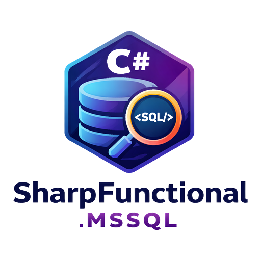

# SharpFunctional.MSSQL

<p align="center">
  
</p>

[](https://www.nuget.org/packages/SharpFunctional.MsSql)
[](https://www.nuget.org/packages/SharpFunctional.MsSql)
[](https://github.com/MPCoreDeveloper/SharpFunctional.MSSQL/actions/workflows/ci.yml)
[](https://github.com/MPCoreDeveloper/SharpFunctional.MSSQL/actions/workflows/publish-nuget.yml)
[](https://opensource.org/licenses/MIT)
[](https://dotnet.microsoft.com/download)
[](https://www.nuget.org/packages/SharpFunctional.MsSql)
[](#testing)
[](https://learn.microsoft.com/en-us/dotnet/csharp/)

[English](README.md) | [Nederlands](docs/README.nl.md)

Functional-first SQL Server access for modern .NET.

`SharpFunctional.MSSQL` is a `.NET 10` / `C# 14` library that combines:
- **Entity Framework Core** convenience
- **Dapper** performance
- **Built-in functional types** (`Option<T>`, `Seq<T>`, `Fin<T>`) — zero external dependencies
- **No-exception API surface** for expected failure paths

---

## Why SharpFunctional.MSSQL?

This package helps you build SQL Server data access with:
- explicit success/failure flows
- composable async operations
- transaction-safe execution
- structured logging
- built-in retry/timeout configuration
- OpenTelemetry tracing hooks
- server-side pagination with navigation metadata
- specification pattern for reusable queries
- batch insert/update/delete operations
- `IAsyncEnumerable<T>` streaming for large data sets
- circuit breaker resilience pattern

---

## Features

### Functional API model (zero-dependency, built-in)
- `Option<T>` for optional values
- `Seq<T>` for query result sequences (backed by `ImmutableArray<T>`)
- `Fin<T>` for success/failure with error context
- `Unit` as void replacement
- `Error` for structured error representation

### EF Core integration (`EfFunctionalDb`)
- `GetByIdAsync<T, TId>`
- `FindOneAsync<T>`
- `QueryAsync<T>`
- `AddAsync<T>`
- `SaveAsync<T>`
- `DeleteByIdAsync<T, TId>`
- `CountAsync<T>`
- `AnyAsync<T>`
- explicit `WithTracking()` mode
- `FindPaginatedAsync<T>` — server-side pagination with `QueryResults<T>`
- `FindAsync<T>(IQuerySpecification<T>)` — specification pattern queries
- `InsertBatchAsync<T>` — configurable batch inserts
- `UpdateBatchAsync<T>` — batch updates with detached-entity support
- `DeleteBatchAsync<T>` — predicate-based batch deletes
- `StreamAsync<T>` — `IAsyncEnumerable<T>` streaming for large data sets

### Dapper integration (`DapperFunctionalDb`)
- `QueryAsync<T>`
- `QuerySingleAsync<T>`
- `ExecuteStoredProcAsync<T>`
- `ExecuteStoredProcSingleAsync<T>`
- `ExecuteStoredProcNonQueryAsync`
- `ExecuteStoredProcPaginatedAsync<T>` — paginated stored procedure results via `QueryMultipleAsync`

### Transaction support (`FunctionalMsSqlDb`)
- `InTransactionAsync<T>` for commit/rollback flows
- `InTransactionMapAsync<TIn, TOut>` for transactional mapping
- support for EF and Dapper backends

### Async + cancellation first
- CancellationToken support on all async public APIs
- cancel propagation through EF, Dapper, retries, and helper extensions

### Resilience options
- `SqlExecutionOptions` for:
  - command timeout
  - max retries
  - exponential backoff
- transient SQL detection (timeouts, deadlocks, service busy/unavailable)
- `CircuitBreaker` pattern:
  - thread-safe state machine (`Closed` → `Open` → `HalfOpen`)
  - configurable failure threshold, open duration, and half-open success threshold
  - functional `ExecuteAsync<T>` returning `Fin<T>`

### Observability
- `ILogger` hooks for lifecycle/failure/retry diagnostics
- OpenTelemetry support via `ActivitySource`:
  - source name: `SharpFunctional.MsSql`
  - transaction activities
  - Dapper query/stored proc activities
  - EF Core activities (pagination, batch insert/update/delete, specification queries)
  - retry events + standardized tags (`backend`, `operation`, `success`, `retry.attempt`)
  - extended tags: `entity_type`, `batch_size`, `item_count`, `page_number`, `page_size`, `duration_ms`, `correlation_id`, `circuit_state`

---

## Architecture

- `FunctionalMsSqlDb` - root facade and transaction orchestration
- `EfFunctionalDb` - functional EF Core operations (CRUD, pagination, batch, streaming, specification)
- `DapperFunctionalDb` - functional Dapper operations (queries, stored procedures, pagination)
- `TransactionExtensions` - transaction mapping helpers
- `FunctionalExtensions` - async functional composition (`Bind`, `Map`)
- `SqlExecutionOptions` - timeout/retry policy configuration
- `SharpFunctionalMsSqlDiagnostics` - tracing constants and `ActivitySource`
- `CircuitBreaker` - thread-safe circuit breaker pattern for database operations
- `CircuitBreakerOptions` - circuit breaker configuration (thresholds, durations)
- `QueryResults<T>` - paginated query result with navigation metadata
- `IQuerySpecification<T>` / `QuerySpecification<T>` - reusable, composable query specifications
- `Option<T>` / `Fin<T>` / `Seq<T>` / `Unit` / `Error` - zero-dependency functional types (replaces LanguageExt)
- `Prelude` - static helpers (`FinFail`, `FinSucc`, `toSeq`, `Optional`, `unit`)
- `ServiceCollectionExtensions` - DI registration helpers
- `FunctionalMsSqlDbOptions` - options class for DI configuration

---

## Installation

```bash
dotnet add package SharpFunctional.MSSQL
```

---

## Dependency Injection

`SharpFunctional.MSSQL` integrates with `Microsoft.Extensions.DependencyInjection` via `IOptions<FunctionalMsSqlDbOptions>`.
`FunctionalMsSqlDb` is registered as **scoped** (one instance per request/scope).

### EF Core only

```csharp
// AppDbContext must already be registered
services.AddDbContext<AppDbContext>(opts => opts.UseSqlServer(connectionString));

services.AddFunctionalMsSqlEf<AppDbContext>(opts =>
{
    opts.ExecutionOptions = new SqlExecutionOptions(commandTimeoutSeconds: 60);
});
```

### Dapper only

```csharp
services.AddFunctionalMsSqlDapper(connectionString, opts =>
{
    opts.ExecutionOptions = new SqlExecutionOptions(
        commandTimeoutSeconds: 30,
        maxRetryCount: 3,
        baseRetryDelay: TimeSpan.FromMilliseconds(200));
});
```

### Both backends (EF + Dapper)

```csharp
services.AddDbContext<AppDbContext>(opts => opts.UseSqlServer(connectionString));

// Pass connection string directly
services.AddFunctionalMsSql<AppDbContext>(connectionString, opts =>
{
    opts.ExecutionOptions = new SqlExecutionOptions(commandTimeoutSeconds: 60, maxRetryCount: 3);
});

// Or put everything in the options delegate
services.AddFunctionalMsSql<AppDbContext>(opts =>
{
    opts.ConnectionString = connectionString;
    opts.ExecutionOptions = new SqlExecutionOptions(commandTimeoutSeconds: 60);
});
```

### Inject and use

```csharp
public class UserService(FunctionalMsSqlDb db)
{
    public async Task<Option<User>> GetUserAsync(int id, CancellationToken ct)
        => await db.Ef().GetByIdAsync<User, int>(id, ct);

    public async Task<Seq<OrderDto>> GetOrdersAsync(int userId, CancellationToken ct)
        => await db.Dapper().QueryAsync<OrderDto>(
            "SELECT * FROM Orders WHERE UserId = @UserId",
            new { UserId = userId },
            ct);
}
```

---

## Quick start

### 1) Configure facade

```csharp
using Microsoft.Data.SqlClient;
using Microsoft.EntityFrameworkCore;
using Microsoft.Extensions.Logging;
using SharpFunctional.MsSql;
using SharpFunctional.MsSql.Common;

var options = new DbContextOptionsBuilder<MyDbContext>()
    .UseSqlServer(connectionString)
    .Options;

await using var dbContext = new MyDbContext(options);
await using var connection = new SqlConnection(connectionString);

var executionOptions = new SqlExecutionOptions(
    commandTimeoutSeconds: 30,
    maxRetryCount: 2,
    baseRetryDelay: TimeSpan.FromMilliseconds(100),
    maxRetryDelay: TimeSpan.FromSeconds(2));

var loggerFactory = LoggerFactory.Create(builder => builder.AddConsole());
var logger = loggerFactory.CreateLogger<FunctionalMsSqlDb>();

var db = new FunctionalMsSqlDb(
    dbContext: dbContext,
    connection: connection,
    executionOptions: executionOptions,
    logger: logger);
```

### 2) EF functional query

```csharp
var user = await db.Ef().GetByIdAsync<User, int>(42, cancellationToken);

user.IfSome(u => Console.WriteLine($"Found: {u.Name}"));
user.IfNone(() => Console.WriteLine("User not found"));
```

### 3) Dapper functional query

```csharp
var rows = await db.Dapper().QueryAsync<UserDto>(
    "SELECT Id, Name FROM Users WHERE IsActive = @IsActive",
    new { IsActive = true },
    cancellationToken);
```

### 4) Transaction flow

```csharp
var result = await db.InTransactionAsync(async txDb =>
{
    var add = await txDb.Ef().AddAsync(new User { Name = "Ada" }, cancellationToken);
    if (add.IsFail) return LanguageExt.Prelude.FinFail<string>(LanguageExt.Common.Error.New("Add failed"));

    await dbContext.SaveChangesAsync(cancellationToken);
    return LanguageExt.Fin<string>.Succ("committed");
}, cancellationToken);
```

### 5) Paginated query

```csharp
var page = await db.Ef().FindPaginatedAsync<User>(
    u => u.IsActive,
    pageNumber: 2,
    pageSize: 25,
    cancellationToken);

page.Match(
    Succ: results =>
    {
        Console.WriteLine($"Page {results.PageNumber}/{results.TotalPages} ({results.TotalCount} total)");
        foreach (var user in results.Items)
            Console.WriteLine(user.Name);
    },
    Fail: error => Console.WriteLine(error));
```

### 6) Specification pattern

```csharp
var spec = new QuerySpecification<Order>(o => o.Total > 1000)
    .SetOrderByDescending(o => o.OrderDate)
    .SetSkip(50)
    .SetTake(25);

var orders = await db.Ef().FindAsync(spec, cancellationToken);

orders.IfSome(list => Console.WriteLine($"Found {list.Count} orders"));
```

### 7) Batch operations

```csharp
// Insert batch
var newUsers = Enumerable.Range(1, 500).Select(i => new User { Name = $"User{i}" });
var inserted = await db.Ef().InsertBatchAsync(newUsers, batchSize: 100, cancellationToken);

// Update batch
var updated = await db.Ef().WithTracking().UpdateBatchAsync(modifiedUsers, batchSize: 100, cancellationToken);

// Delete batch
var deleted = await db.Ef().DeleteBatchAsync<User>(u => u.IsActive == false, batchSize: 200, cancellationToken);
```

### 8) Streaming large results

```csharp
await foreach (var user in db.Ef().StreamAsync<User>(u => u.IsActive, cancellationToken))
{
    await ProcessUserAsync(user, cancellationToken);
}
```

### 9) Circuit breaker

```csharp
var options = new CircuitBreakerOptions
{
    FailureThreshold = 5,
    OpenDuration = TimeSpan.FromSeconds(30),
    SuccessThresholdInHalfOpen = 2
};

var breaker = new CircuitBreaker(options);

var result = await breaker.ExecuteAsync(
    async ct => await db.Ef().GetByIdAsync<User, int>(42, ct),
    cancellationToken);

// result is Fin<Option<User>> — check breaker state
Console.WriteLine($"Circuit state: {breaker.State}");
```

### 10) Dapper paginated stored procedure

```csharp
var page = await db.Dapper().ExecuteStoredProcPaginatedAsync<OrderDto>(
    "usp_GetOrders",
    new { StatusId = 1, PageNumber = 1, PageSize = 50 },
    cancellationToken);

page.Match(
    Succ: results => Console.WriteLine($"Page {results.PageNumber} of {results.TotalPages}"),
    Fail: error => Console.WriteLine(error));
```

---

## OpenTelemetry integration

Use the source name below in your tracer configuration:

```text
SharpFunctional.MsSql
```

Emitted telemetry includes:
- transaction activities (EF and Dapper)
- Dapper operation activities (`dapper.query.seq`, `dapper.query.single`, `dapper.storedproc.*`)
- EF Core operation activities (`ef.find.paginated`, `ef.find.spec`, `ef.batch.insert`, `ef.batch.update`, `ef.batch.delete`)
- retry events and standardized tags (`backend`, `operation`, `success`, `retry.attempt`)
- extended diagnostic tags:
  - `entity_type` — the entity CLR type name
  - `batch_size` — batch size for bulk operations
  - `item_count` — number of affected items
  - `page_number` / `page_size` — pagination parameters
  - `duration_ms` — operation duration in milliseconds
  - `correlation_id` — links related operations
  - `circuit_state` — circuit breaker state

---

## Build

```bash
dotnet restore
dotnet build SharpFunctional.MSSQL.slnx -c Release
```

## Pack NuGet

```bash
dotnet pack src/SharpFunctional.MSSQL/SharpFunctional.MSSQL.csproj -c Release -o ./artifacts/packages
```

Generates:
- `.nupkg`
- `.snupkg`

---

## Tests

```bash
dotnet test tests/SharpFunctional.MSSQL.Tests
```

Test suite uses `xUnit v3` and includes LocalDB-backed integration tests.

---

## Repository structure

- `src/` — library source
- `tests/` — xUnit v3 test suite (150+ tests)
- `examples/` — runnable sample applications:
  - `SharpFunctional.MSSQL.Example` — full-featured console app (16 sections covering CRUD, aggregates, functional chaining, Dapper, transactions, pagination, specification pattern, batch operations, streaming, circuit breaker, and DI)
  - `SharpFunctional.MSSQL.DI.Example` — dependency injection example with `ProductService` demonstrating all three registration overloads, pagination, specification queries, batch inserts, streaming, and circuit breaker
- `docs/` — additional documentation
- `.github/` — CI/CD and repo automation
- `CHANGELOG.md` — version history
- `MIGRATION_v1_to_v2.md` — upgrade guide from v1 to v2

---

## Examples

Two runnable console applications demonstrate every feature of the library:

### Full example (`examples/SharpFunctional.MSSQL.Example`)

A comprehensive 16-section walkthrough covering:

| Section | Feature |
|---------|---------|
| 1–2 | Database setup and seed data (customers, products, orders) |
| 3 | EF Core queries — `GetByIdAsync`, `FindOneAsync`, `QueryAsync` |
| 4 | Aggregates — `CountAsync`, `AnyAsync` |
| 5 | Functional chaining — `Option → Seq`, `Option → Option`, `Seq → Seq` |
| 6 | Dapper queries — raw SQL, single result, joins |
| 7–8 | Transactions and `InTransactionMapAsync` |
| 9 | Delete and verify |
| 10 | **Paginated queries** — `FindPaginatedAsync` with `QueryResults<T>.Map` |
| 11 | **Specification pattern** — `QuerySpecification<T>` with ordering and skip/take |
| 12 | **Batch operations** — `InsertBatchAsync`, `UpdateBatchAsync`, `DeleteBatchAsync` |
| 13 | **Streaming** — `StreamAsync<T>` with `await foreach` |
| 14 | **Circuit breaker** — success, trip to Open, rejection, reset |
| 15–16 | Final summary and DI container demo |

### DI example (`examples/SharpFunctional.MSSQL.DI.Example`)

Demonstrates `FunctionalMsSqlDb` registration and consumption via constructor injection:

- All three registration overloads: EF-only, Dapper-only, EF + Dapper combined
- `ProductService` with methods for: `GetByIdAsync`, `GetByCategoryAsync`, `CountInStockAsync`, `GetSummariesAsync`, `GetPaginatedAsync`, `GetBySpecificationAsync`, `BatchInsertAsync`, `StreamAllAsync`, `AddProductAsync`
- Circuit breaker integration wrapping service calls

```bash
# Run the full example (requires SQL Server LocalDB)
cd examples/SharpFunctional.MSSQL.Example
dotnet run

# Run the DI example
cd examples/SharpFunctional.MSSQL.DI.Example
dotnet run
```

---

## Release process

1. Create and push a semantic version tag (for example `v0.1.0`).
2. GitHub Actions builds and packs the library.
3. Release workflow publishes to NuGet.org using `NUGET_API_KEY`.

---

## License

MIT. See `LICENSE`.

---

## Contributing

Issues and pull requests are welcome.
